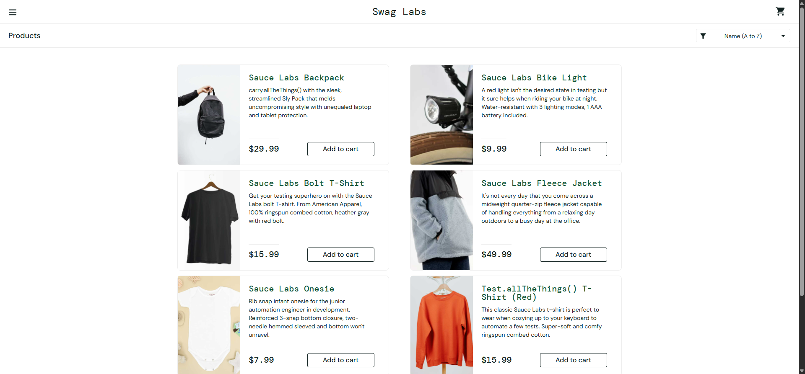

# Relatório de Teste - SauceDemo

## TC-001: Login bem-sucedido com usuário padrão

**Objetivo:**  
Verificar se é possível fazer login com credenciais válidas no site SauceDemo e se após o login a página de produtos é exibida corretamente.

**Passos Executados:**
1. Acessar o site [https://www.saucedemo.com/](https://www.saucedemo.com/)
2. Inserir o nome de usuário `'standard_user'` no campo de nome de usuário
3. Inserir a senha `'secret_sauce'` no campo de senha
4. Clicar no botão de login
5. Verificar se o usuário é redirecionado para a página de produtos

**Dados de Entrada:**
- Nome de usuário: `standard_user`
- Senha: `secret_sauce`

**Resultado Esperado:**
- O usuário deve ser redirecionado para a página de produtos (`https://www.saucedemo.com/inventory.html`)
- O elemento com ID `inventory_container` deve estar presente na página, indicando que os produtos foram carregados

**Resultado Obtido:**
- O usuário foi redirecionado para a URL `https://www.saucedemo.com/inventory.html`
- O elemento `inventory_container` foi encontrado na página
- Screenshot salvo automaticamente:
 

**Status:** ✅ **PASSOU**

---