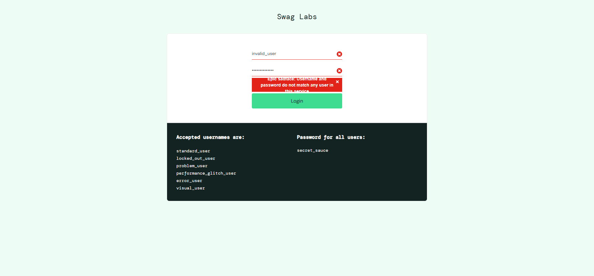

## TC-002: Login mal-sucedido com usuário inválido

**Objetivo:**  
Verificar se o sistema exibe uma mensagem de erro apropriada ao tentar fazer login com credenciais inválidas.

**Passos Executados:**
1. Acessar o site [https://www.saucedemo.com/](https://www.saucedemo.com/)
2. Inserir o nome de usuário `'invalid_user'` no campo de nome de usuário
3. Inserir a senha `'wrong_password'` no campo de senha
4. Clicar no botão de login
5. Verificar se uma mensagem de erro apropriada é exibida

**Dados de Entrada:**
- Nome de usuário: `invalid_user`
- Senha: `wrong_password`

**Resultado Esperado:**
- O usuário deve permanecer na página de login
- Uma mensagem de erro deve ser exibida no elemento com a classe `error-message-container`
- A mensagem deve indicar que as credenciais são inválidas

**Resultado Obtido:**
- O usuário permaneceu na página de login
- Uma mensagem de erro foi exibida no elemento apropriado
- A mensagem exibida foi: `"Epic sadface: Username and password do not match any user in this service"`
- Screenshot salvo automaticamente:

**Status:** ✅ **PASSOU**

---

## Resumo da Execução

| ID      | Título                                  | Status | Duração   |
|---------|------------------------------------------|---------|-----------|
| TC-001  | Login bem-sucedido com usuário padrão     | PASSOU ✅ | [4.30 seg] |
| TC-002  | Login mal-sucedido com usuário inválido   | PASSOU ✅ | [4.13 seg] |

---

## Observações Adicionais
- Os testes foram executados usando o **Chrome WebDriver**.
- Ambos os casos de teste foram bem-sucedidos, demonstrando que o sistema de login do SauceDemo está funcionando conforme esperado.
- Os timestamps reais serão registrados durante a execução do script.
- As capturas de tela dos resultados finais estão disponíveis na pasta `relatorios/`.